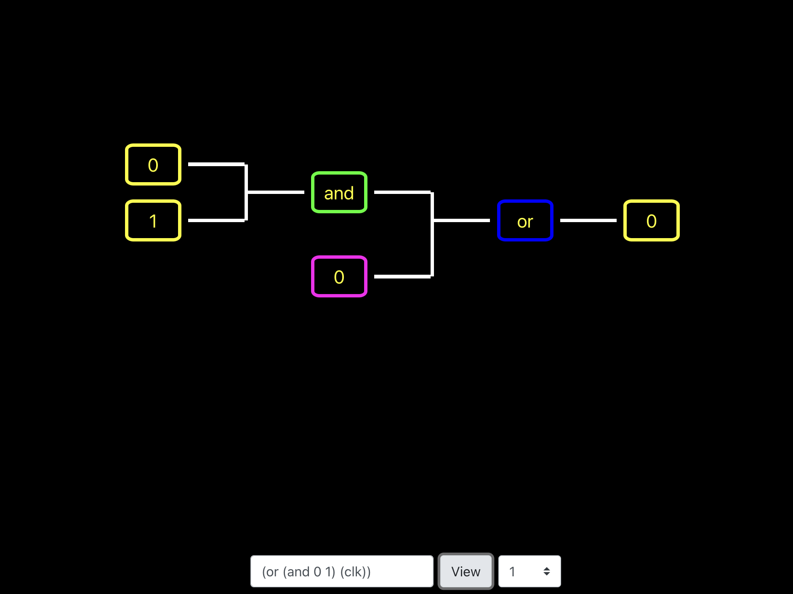

# Hardware Simulator

Simulates hardwares from the "atom" size being a gate. Constructs
the view from the input provided at the bottom of the screen.

Start the simulator with `npm start`

# Using the simulator

An input at the bottom will accept logical strings in a Lisp-like
command format. Pressing the `View` button will allow a properly
formatted string to be illustrated as gate representations in the
view. A clock input will switch between `0` and `1` at a rate based on
the time selector to the right of the logic input.

Current allowed gates are `and`, `or`, `not`, and `xor`. Inputs can be
single- or multi-bit inputs of `0`s and `1`s, but gates cannot take inputs
of different bit lengths.

Sample strings:

- `(and 1101 1010)` calculates the result of "and"-ing each bit of the 4 bit sources, resulting in `1000`
- `(not (xor 1 (clk)))` calculates the opposite ("not") of the result of the "xor" of `1` and a clock input, resulting in the same output as the clock input
- `(and (not 01) (not (or 10 01)))` calculates the result of... well, it's the same as `¬(01) ∧ ¬(10 ∨ 01)`, resulting in `00`

# Future Features

- [x] XOR gate
  - [x] Parser
  - [x] Calculator
  - [x] Gate
- [x] Multibit inputs
  - [x] Parser
  - [x] Calculator
  - [x] Updated unit tests
- [x] Clock (no inputs, only out an alternating value) - e.g. (and (clk) 1)
  - [x] Parser
  - [x] Calculator
  - [x] Gate
- [x] Control the clock timing with a new input (how many seconds between each clock tick)
  - [x] Form input
- [ ] Register (takes in the value to save and value that controls when that save happens) - e.g. (and (reg (clk) (clk)))
  - [ ] Parser
  - [ ] Calculator
  - [ ] Gate
- [ ] Logic snippet variables
  - [ ] Parser
  - [ ] Calculator
  - [ ] Gate
  - [ ] Variable panel
- [ ] Create logic functions - e.g. ((fn (x y) (and x y)) x y)
  - [ ] Parser
  - [ ] Calculator
